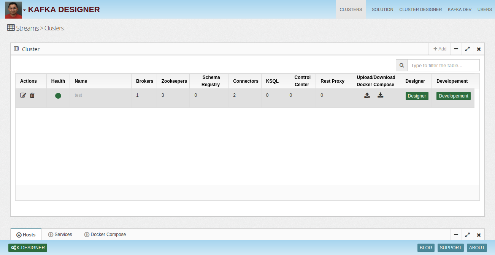
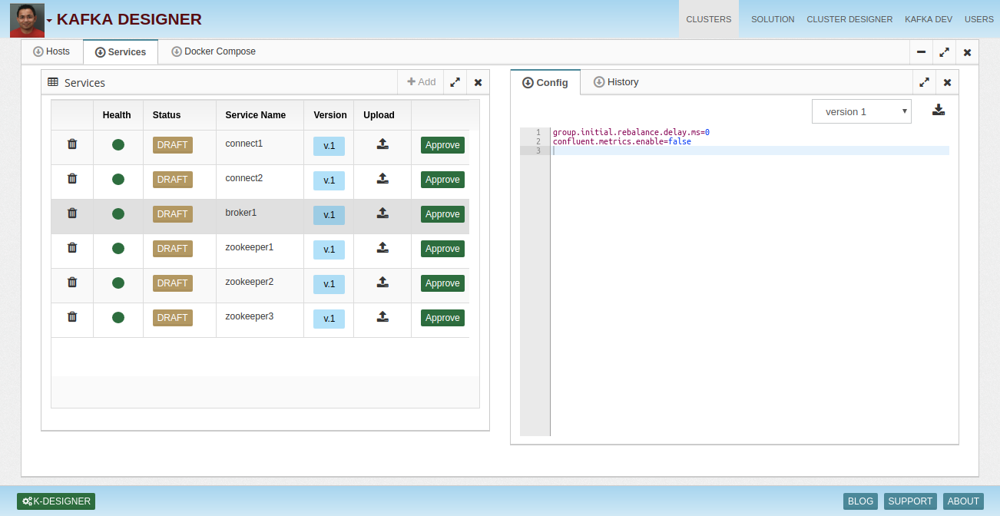
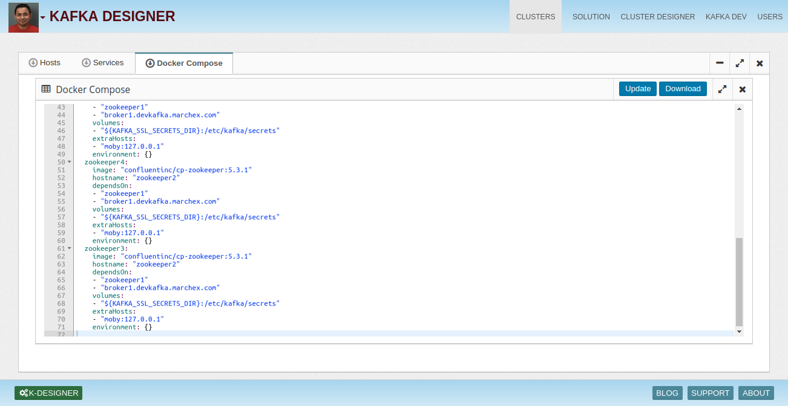
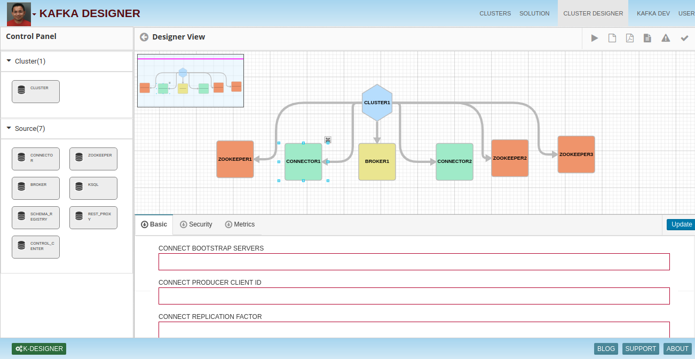
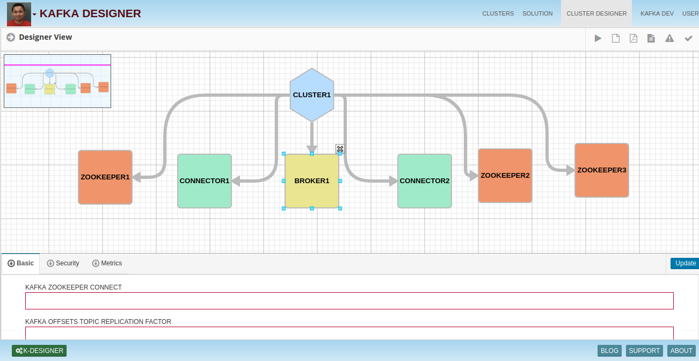
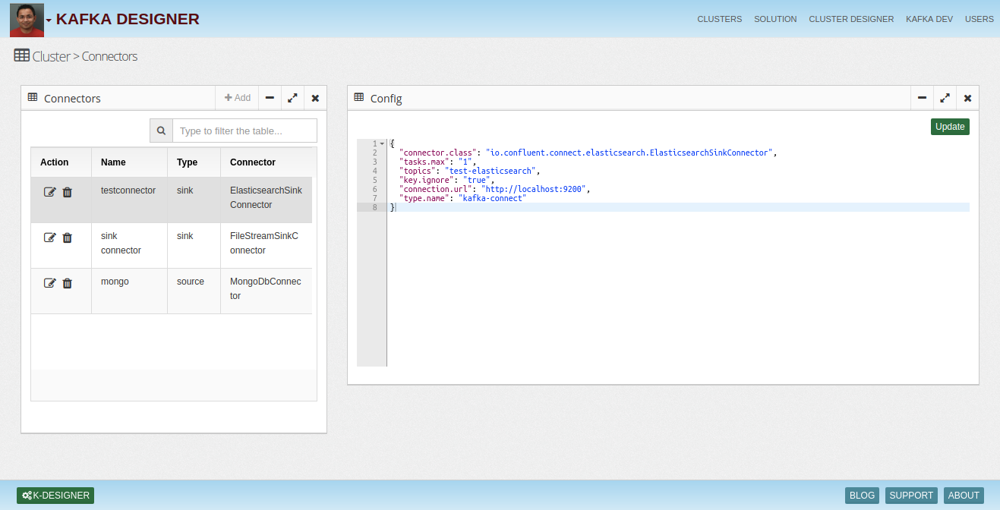

# Kafka-Designer
Design your Kafka Cluster in few minutes

# Cluster Designer

## Design a new cluster in few minutes
Kafka designer provides a nice intuitive UI and enables drag and drop cluster design. It does the provisioing by asking critical requirements in simple steps and builds a consistent and robust cluster. 

## Optimize Your Existing Cluster
Upload your configuration files. Kafka designer will suggest changes and you can download latest configuration files.

## Development Template Generation
Kafka Designer allows you to generate Docker compose blueprint to mimic your other environments so your developers can easily develop consistent apps.

## Visualize Cluster
Designer allows you to visualize your cluster.

## Connector
Allows you to create connectors depend upon type (sink or source) with default config.

## Download Sample Applications
Kafka designer allows you to generate sample coonsumer, producer or streams app template using your cluster configuration. This expedites the app development process.

## Topic Designer
Allows you to design topics using right naming conventions, partitions, replication factors and retention.

License
------
InsightLake Data Explorer is a commercial product but distributed to be used freely. Please contact contact@insightlake.com for details.

Getting Help
----------

You can get help easily :
Slack Channel - [Join InsightLake Slack Community](https://join.slack.com/t/insightlake/shared_invite/enQtNzQzMDE3MDI4ODA1LWM2YmI5MDUzODM5ZjQzZjE3ZDk1MjhiNThjMTBkODJjMGU2OWJmOWQ0MDE5NGI4YjYyYjVhZjEzYzY3YzIzMjY)

Twitter - https://twitter.com/InsightLake

Facebook - https://www.facebook.com/insightlake/

Installation using docker 
------
* Download or clone the repository. 
* cd docker
* docker-compose -f docker-compose.yaml -up 

