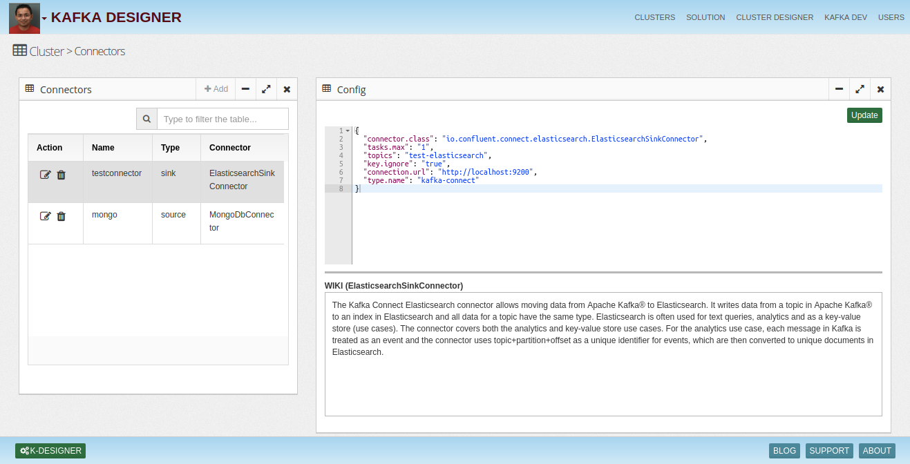

# Kafka-Designer

Design your Kafka Cluster in few minutes and cut down provisioning time from 2-4 weeks to 1-2 days. 

# Introduction
Kafka deployment is very configuration driven and causes a lot of manual errors. People new to Kafka don’t have complete understanding of the best practices and recommended parameter values. 

Companies in general spend 2-4 weeks in setting up the Kafka cluster and lot of time gets spent in fixing configuration errors making the whole process manual, tedious and error prone.
Also every company's environment is different and right cluster should be provisioned to utilize the Kafka environment fully.

Kafka Designer’s main goal is to enable teams to generate a robust Kafka cluster template driven by best practices and reduce manual errors.

## Kafka Versions
Teams can generate configuration for:
* Confluent Kafka 
* Apache Kafka
* AWS MSK *** Pending

## Platforms
Kafka configuration can be generated for different cluster options:
* VMs - On Premise, Cloud
* Kubernetes - Manifest files, Operator Charts
* Managed Services - Confluent Cloud, AWS MSK

| Type         | Sub Type | Components                                                                                      | Config                                                                                                                                                                                                                         |
|--------------|----------|-------------------------------------------------------------------------------------------------|--------------------------------------------------------------------------------------------------------------------------------------------------------------------------------------------------------------------------------|
| Confluent    | VMs      | Broker, Zookeeper, Schema Registry, REST Proxy, Replicator, Kafka Connect, Control Center, KSQL | *** Download config files, SSL stores, JMX agents, Log Agents  *** Download docker-compose, SSL stores, JMX agents, Log Agents in volumes  *** Download Operator charts, SSL stores, JMX agents, Log Agents  *** Download Ansible or Terraform |
|              | Cloud    | REST Proxy, Replicator, Kafka Connect, Control Center, KSQL                                     | *** Download config files  *** Download docker compose   *** Download K8 manifest files  *** Download Operator charts                                                                                                                          |
| Apache Kafka | VMs      | Broker, Zookeeper, Schema Registry, Mirror Maker, Kafka Connect                                 | *** Download config files  *** Download docker compose  *** Download manifest files  *** Download Strimzi Operator Charts                                                                                                                      |
## Kafka Cluster Design
Users can use the designer tool to provision a Kafka cluster. Following are the important properties they need to provide:

* Name - Cluster name
* Type - Apache, Confluent, Confluent Cloud, MSK
* Listeners - List of open channels with security
* Security Selection - SASL, SSL
* Authorization 
  * ACLs
  * RBAC
* Monitoring 
  * JMX 
  * JMX Tool - Prometheus, AppDynamics, DataDog
  * Metrics Reporting
  * Interceptors
* Log Management
  * Splunk
  * ELK

## Configuration Downloads
* VM Configuration bundle
  * Folder for hosts containing property files
  * TLS keystores and truststores
  * SASL JAAS
  * JMX agents
  * Log agents
* Docker Compose
  * Docker compose file with all the components
  * Volumes/folders for SSL, SASL, JMX, Log agents
* Kubernetes - Manifest
  * Manifest files for components
  * Folders for SSL, SASL etc.
* Kubernetes - Operator
  * Operator charts
  * Folder for SSL, SASL etc

## JMX Dashboards Downloads
* Config files
* Grafana, AppDynamics etc

## Development Templates
* Producer, consumer examples - Java, Python, C#

## Connector Configuration
* S3, Replicator..

# Cluster Designer

## Design a new cluster in few minutes
Kafka designer provides a nice intuitive UI and enables drag and drop cluster design. It does the provisioing by asking critical requirements in simple steps and builds a consistent and robust cluster. 

## Optimize Your Existing Cluster
Upload your configuration files. Kafka designer will suggest changes and you can download the suggested configuration files.

## Development Template Generation
Kafka Designer allows you to generate Docker compose blueprint to mimic your other environments so your developers can easily develop consistent apps.

## Visualize & Design Cluster
Designer allows you to create and visualize your cluster intuitively.

## Connector
Allows you to generate connectors depending upon type (sink or source) with configurations following best practices and suitable for your designed cluster.

## Download Sample Applications
Kafka designer allows you to generate sample coonsumer, producer or streams app template using your cluster configuration. This expedites the app development process.

## Topic Designer
Allows you to design topics using right naming conventions, partitions, replication factors and retention.

# Installation using docker 
* Download or clone the repository. 
* cd /docker
* Run `docker-compose -f docker-compose.yaml up --build`
* Open browser with URL as http://localhost:8080/

# License
InsightLake Kafka Designer is a commercial product but distributed to be used freely. Please contact contact@insightlake.com for details.

# Getting Help
You can get help easily :
Slack Channel - [Join InsightLake Slack Community](https://join.slack.com/t/insightlake/shared_invite/enQtNzQzMDE3MDI4ODA1LWM2YmI5MDUzODM5ZjQzZjE3ZDk1MjhiNThjMTBkODJjMGU2OWJmOWQ0MDE5NGI4YjYyYjVhZjEzYzY3YzIzMjY)

Twitter - https://twitter.com/InsightLake

Facebook - https://www.facebook.com/insightlake/

