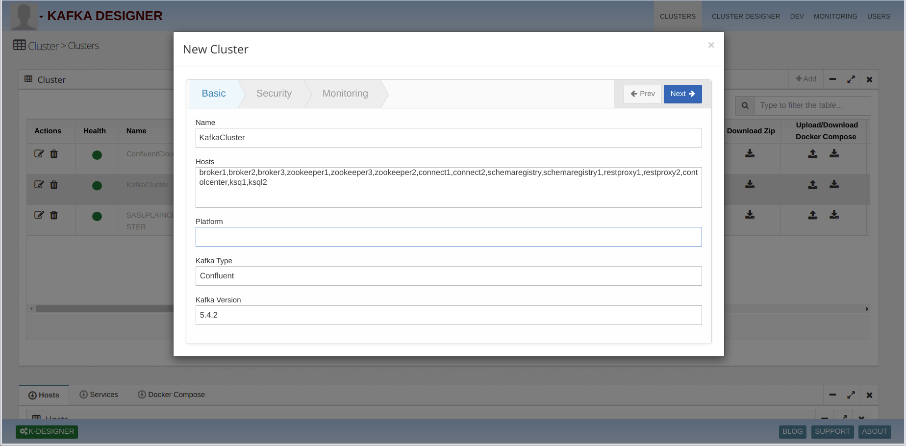
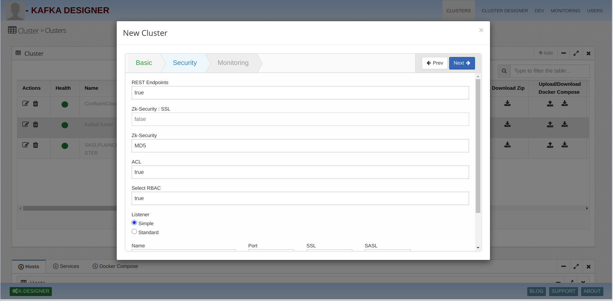
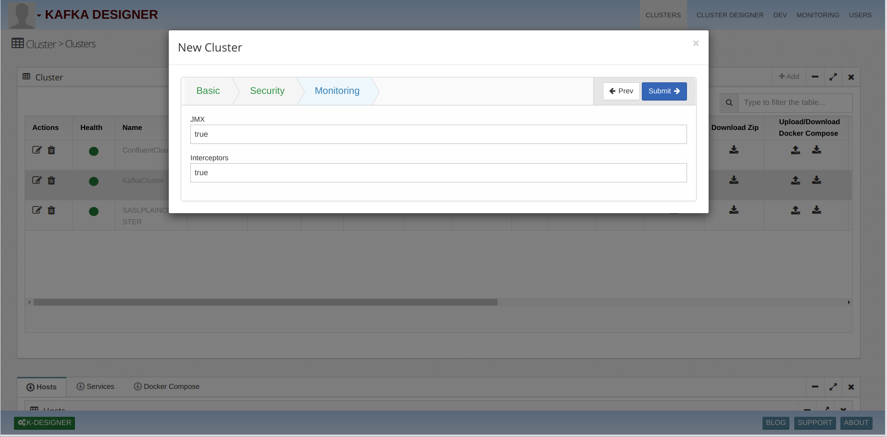
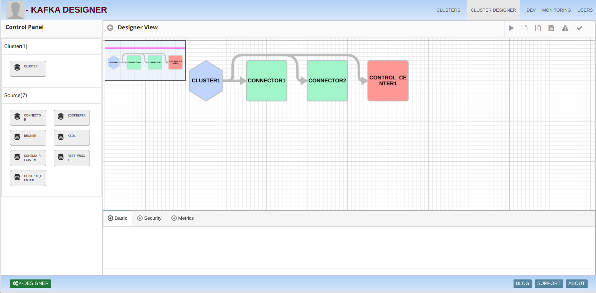

# Kafka.Cluster

## 1)Create RBAC and KERBEROS Configuration for Ansible Cluster
   i)Add host Of Component  
   ii)Select Confluent Clod Cluster Type 
  iii)We can select version from kafka version dropdown 

   
   
   2)Specify cluster Security 
    i)We can configure rest end point security by enabling flag true 
   ii)We can configure Zookeeper security 
  iii)We Can configure RBAC by enable true flag  
      if RBAC enable rbac listener required 
   iv)Select SASL type GSSAPI it will enable kerberos
  
    
   
   
   
   
   3)Specify cluster Monitoring 	
     Here we can configure Monitoring options by enable flag iterceptore and jmx
   
   
   
   4)Adding components using Designer 	
      i) Click on Designer button 
     ii) Drag and Drop cluster component from Left menu
    
   
   
 
   
   5)Download Cluster 
     ii)Select Cluster and click on Download Zip arrow and select Ansible Type 
     
   

