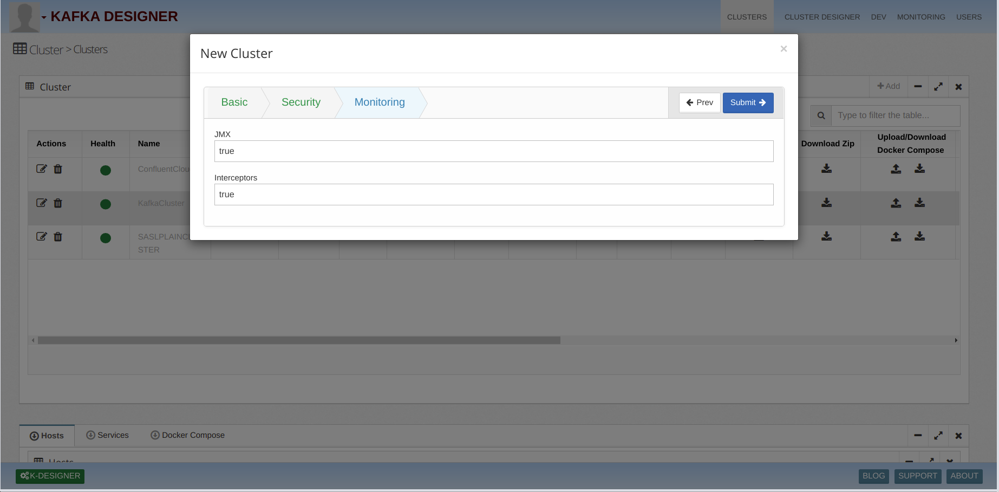
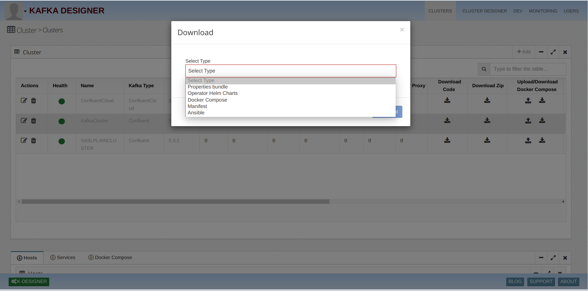

# Kafka.Cluster

## 1)Create Docker for Confluent Cloud Cluster
   i)Add host Of Component  
   ii)Select Confluent Clod Cluster Type 
  iii)We can select version from kafka version dropdown 

   
   
   2)Add Confluent Cloud Configuration 
    i)Add Bootstrap Server Url 
   ii)Add Schema Registry Url 
  iii)Add Schema UserName 
   iv)Add Schema Password 
   iv)Add Cluster Username 
   iv)Add Cluster Password 
  
    
   
   
   
   
   3)Specify cluster Monitoring 	
     Here we can configure Monitoring options by enable flag iterceptore and jmx
   
   
   
   4)Adding components using Designer 	
      i) Click on Designer button 
     ii) Drag and Drop cluster component from Left menu
    
   
   
 
   
   5)Download Cluster 
     ii)Select Cluster and click on Download Zip arrow and select Ansible Type 
     
   

