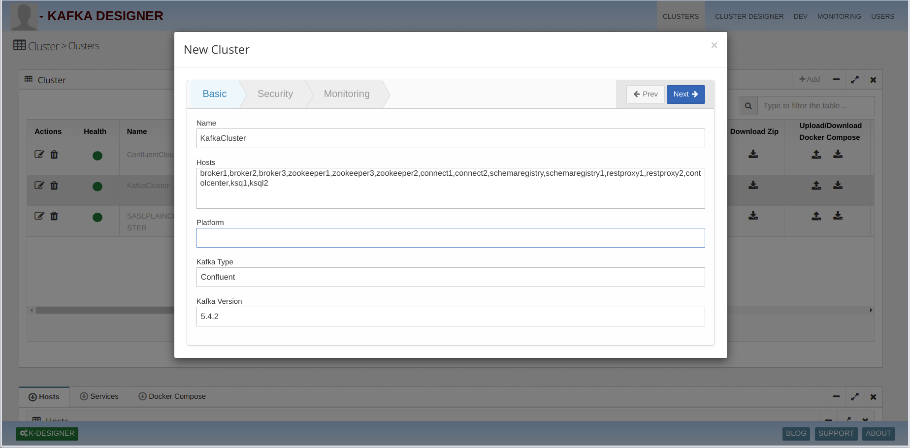
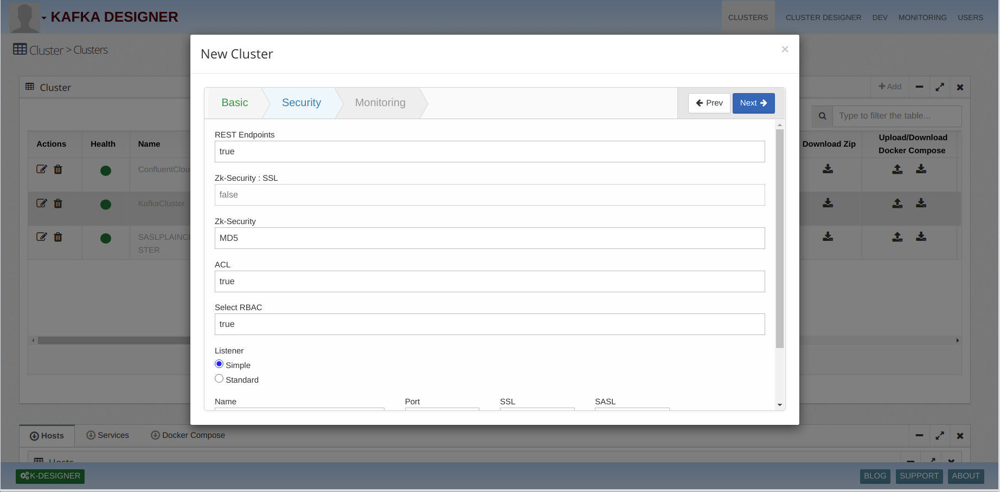
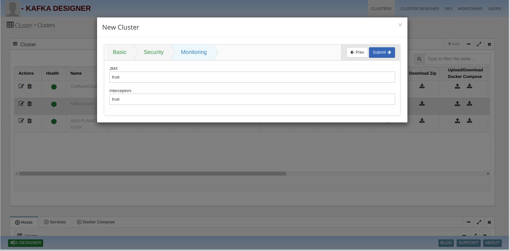
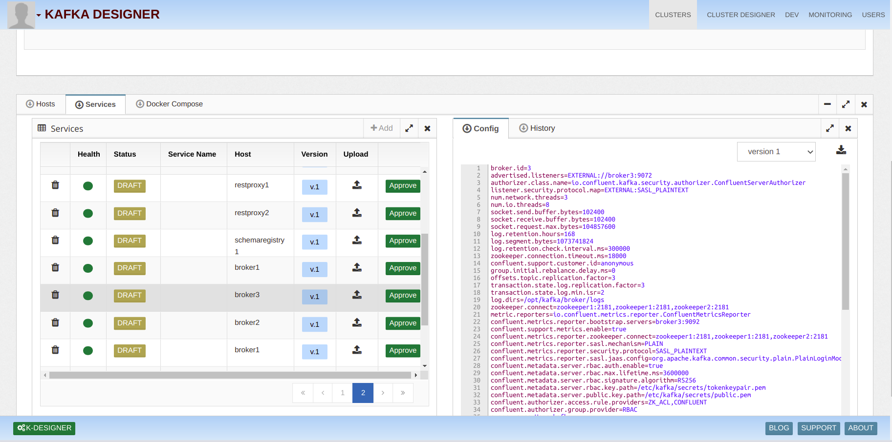
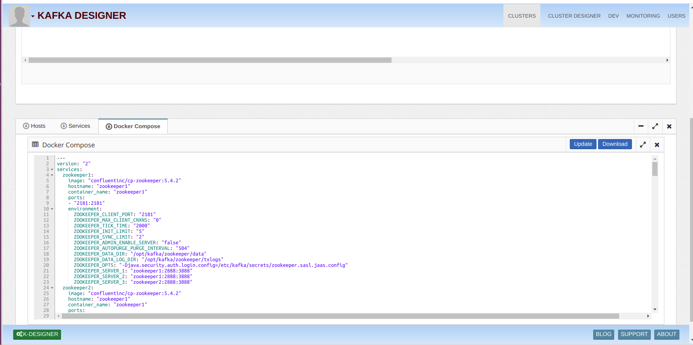
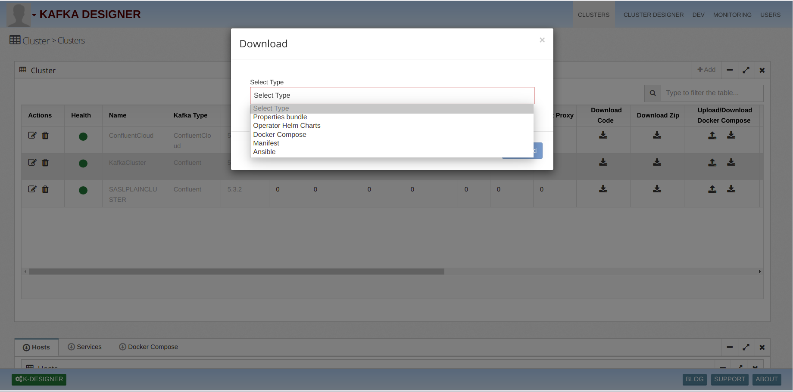
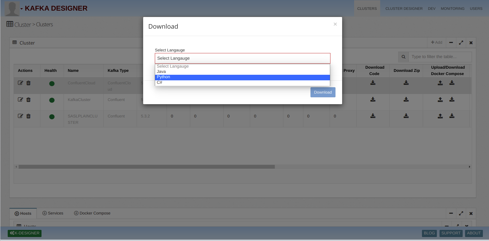

# Kafka.Cluster

## 1)Create SASL_PLAINTEXT Cluster
   i)Add host Of Component  
   ii)Select Confluent Clod Cluster Type 
  iii)We can select version from kafka version dropdown 

   
   
   2)Specify cluster Security 
    i)We can configure rest end point security by enabling flag true 
   ii)We can configure Zookeeper security 
  iii)We Can configure RBAC by enable true flag  
      if RBAC enable rbac listener required 
   iv)We can provide different type of security mechanism using listener  
      i.e want to create SASL_PLAINTEXT configuration 
      select SSL PLAINTEXT from dropdown and SASL PLAIN  
    v)We can configure multiple type of configuration like SASL_PLAINTEXT,SASL_GGSAPI,SASL_SCRAM,SASL_OUTHBEARER 
      Ans SSL configuration SSL_PLAINTEXT,SSL_GGSAPI,SSL_SCRAM,SSL_OUTHBEARER 
    vi)We Can configure Multiple listener to cluster  
    vii)For creating SASL_PLAINTEXT cluster select SSL PLAINTEXT from dropdown and PLAIN from SASL dropdown
    
   
   
   
   
   3)Specify cluster Monitoring 	
     Here we can configure Monitoring options by enable flag iterceptore and jmx
   
   
   
   4)Adding components using Designer 	
      i) Click on Designer button 
     ii) Drag and Drop cluster component from Left menu
    
   
   
   4)View Cluster Detail 
    i) Select Cluster Below Tab you can find components  
   ii) Click On components to view property configuration, right side you can check properties  
    ii) To view Docker compose configuration. Click on Docker Compose Tab
    
   
   
   
   
   5)Download Cluster 
     i)We can download five type of configuration 
      Properties Configuration,Operatore Configuration,Docker ,Properties,Configuration,Manifest Configuration 
     ii)Select Cluster and click on Download Zip arrow and select Type 
     
   
   
 5)Download Sample Code 
     i)We can download three  of sample code it contain kafka consumer producer  
      We provide example in three languages Java,C#,Python 
    ii)Select Cluster and click on Download Code arrow and select Type 

     
   
